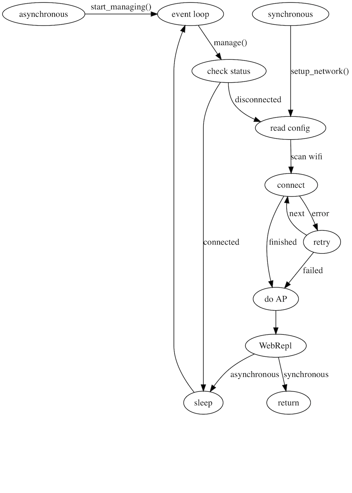

# micropython-wifimanager
A simple network configuration utility for MicroPython on boards such as ESP8266 and ESP32.

Simply upload your JSON file with your networks, the default path is '/networks.json', which is specified in the class property `config_file`.

A sample configuration may look like this:

	{
		"schema": 2,
		"known_networks": [
			{
				"ssid": "User\u2019s iPhone",
				"password": "Password1",
				"enables_webrepl": false
			},
			{
				"ssid": "HomeNetwork",
				"password": "Password2",
				"enables_webrepl": true
			}
		],
		"access_point": {
			"config": {
				"essid": "Micropython-Dev",
				"channel": 11,
				"hidden": false,
				"password": "P@55W0rd"
			},
			"enables_webrepl": true,
			"start_policy": "fallback"
		}
	}

#### Configuration schema

* **schema**: currently this should be `2`
* **known_networks**: list of networks to connect to, in order of most preferred first
	* SSID - the name of the access point
	* password - the clear test password to use
	* enables_webrepl - a boolean value to indicate if connection to this network desires webrepl being started
* **access_point**: the details for the access point (AP) of this device
	* config - the keys for the AP config, exactly as per the micropython documentation
	* enables_weprepl - a boolean value to indicate if ceating this network desires webrepl being started
	* start_policy - A policy from the below list to indicate when to enable the AP
		* 'always' - regardless of the connection to any base station, AP will be started
		* 'fallback' - the AP will only be started if no network could be connected to
		* 'never' - The AP will not be started under any condition

#### Simple usage (one shot)

Here's an example of how to use the WifiManager.

	MicroPython v1.9.4 on 2018-05-11; ESP32 module with ESP32
	Type "help()" for more information.
	>>> from wifi_manager import WifiManager
	>>> WifiManager.setup_network()
	connecting to network Foo-Network...
	WebREPL daemon started on ws://10.1.1.234:8266
	Started webrepl in normal mode
	True

#### Asynchronous usage (event loop)

The WifiManager can be run asynchronously, via the cooperative scheduling that micropthon has in uasyncio. If you call `WifiManager.start_managing()` as follows, it will ensure that periodically the network status is scanned, and connection will be re-established as per preferences as needed.

	import uasyncio as asyncio
	from wifi_manager import WifiManager

	WifiManager.start_managing()
	asyncio.get_event_loop().run_forever()

#### Contribution

Found a bug, or want a feature? open an issue.

If you want to contribute, create a pull request.
